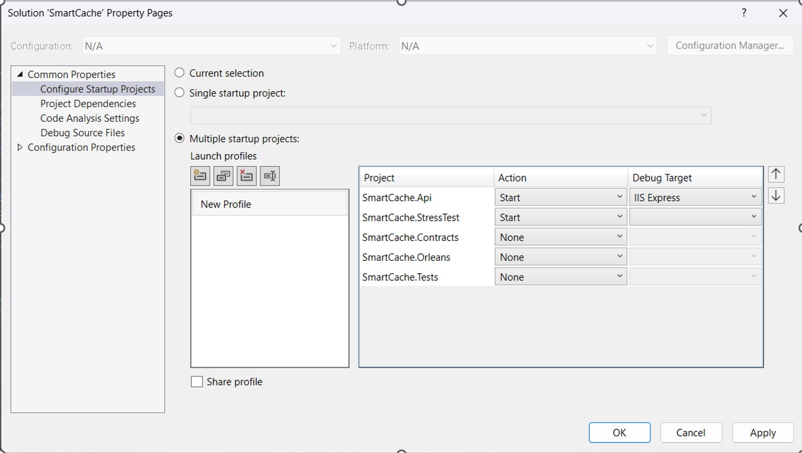
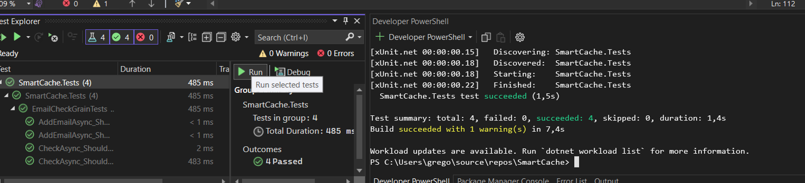
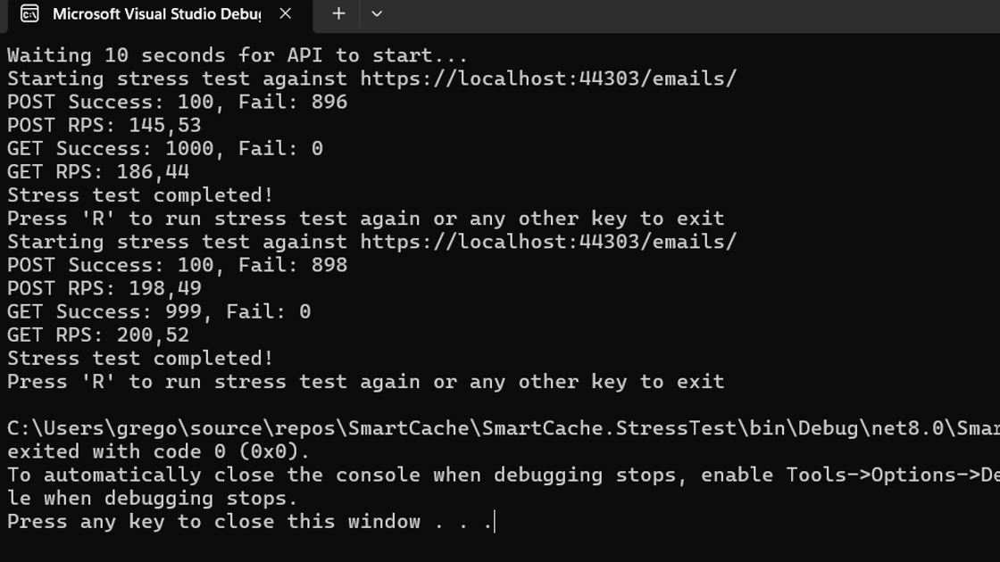
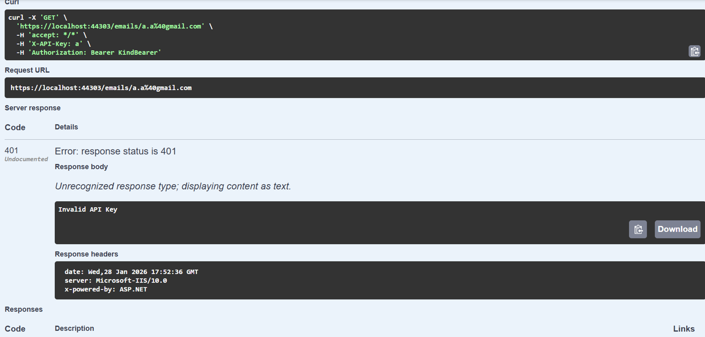
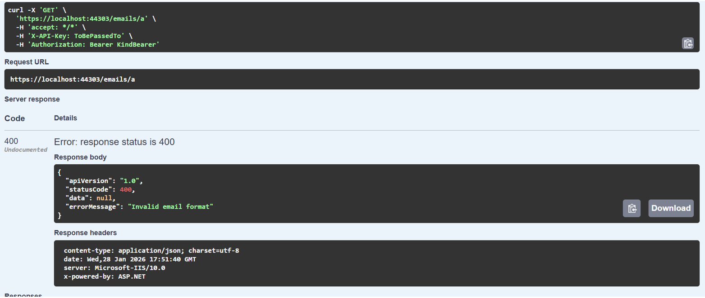
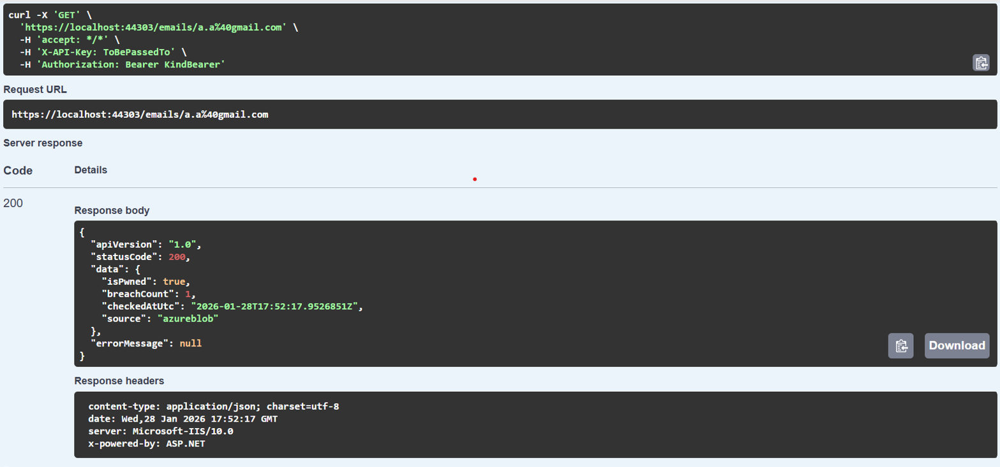
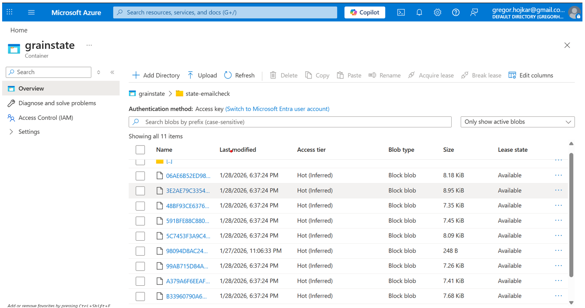
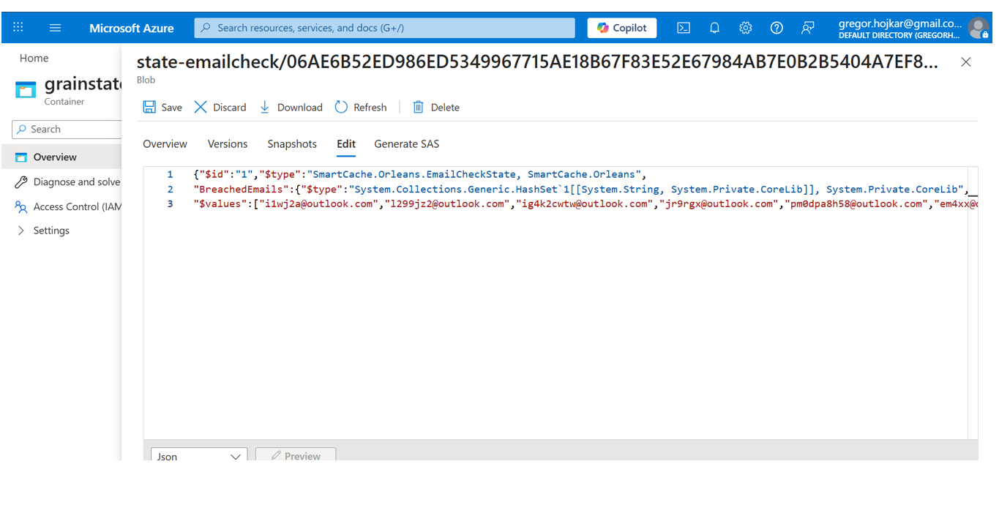

# Smart Cache

Smart Cache is a distributed email breach checker built with **Microsoft Orleans**, **ASP.NET Core**, and **Azure Blob Storage**.  
It provides fast, secure, and scalable access to breached email addresses, similar to [Have I Been Pwned](https://haveibeenpwned.com/).

## Table of Contents

1. [Overview](#overview)  
2. [Features](#features)  
3. [Architecture](#architecture)  
4. [Setup & Configuration](#setup--configuration)  
5. [Running Tests](#running-tests)  
6. [Screenshots](#screenshots)  
7. [Security](#security)  
8. [Possible improvements](#possible--improvements)
9. [Notes](#notes) 

## Overview

Smart Cache quickly checks if email addresses have been exposed in data breaches. It stores emails in **grains**, which are small units managed by **Microsoft Orleans**. Orleans handles distribution and scaling across multiple nodes.

Grains can save their data to **Azure Blob Storage** for durability, or use **in-memory storage** for fast local testing and immediate lookups.

This setup provides fast and reliable access to breached emails. 

---

## Features

- **GET** `/emails/{email}` → Returns `200 OK` if email is breached, `404 Not Found` otherwise  
- **POST** `/emails/{email}` → Adds a new email; `201 Created` if successful, `409 Conflict` if exists  
- **In-memory cache** for fast local testing  
- **Azure Blob Storage** for persistent storage  
- **Unit tests** for grain logic  
- **Stress test** project to simulate concurrent requests  
- Email validation and standardized error responses  

---

## Architecture

[Client] → [API Controller] → [Orleans Grain] → [In-Memory Cache / Azure Blob Storage]

The client communicates with the system through a REST API. The API controller resolves the email domain, computes its hash, and routes the request to the corresponding Orleans grain. Each grain represents a logical partition of data, grouped by email domain, and holds its state in memory for fast access.

Orleans grains act as a distributed in-memory cache, allowing read and write operations to be handled with very low latency. To ensure durability and recoverability, each grain is configured to persist its state to Azure Blob Storage on a fixed interval. State persistence is scheduled to run every 5 minutes using a grain timer, which reduces write pressure on the storage layer while keeping data reasonably up to date.

This design balances performance and reliability by serving requests directly from memory, while periodically synchronizing grain state to Azure Blob Storage for longterm persistence.  

---

## Setup & Configuration

1) Clone the repository:

```powershell
git clone https://github.com/HOGcpu/SmartCache.git
cd SmartCache
```

2. Configure appsettings.json:
```json
{
  "UseInMemoryStorage": true,
  "AzureStorage": {
    "ConnectionString": "<your-azure-blob-connection-string>"
  },
  "Security": {
    "ApiKey": "<your-api-key>",
    "BearerToken": "<your-bearer-token>"
  },
  "StressTest": {
    "ApiUrl": "https://localhost:44303/emails/"
  }
}
```

- Set UseInMemoryStorage to true for fast local testing without Azure.
- AzureStorage.ConnectionString is required if UseInMemoryStorage is false.
- ApiKey and BearerToken are used by the API middleware for simple security.

3. Build and run the API:

```powershell
dotnet run --project SmartCache.Api
```

The API will be available at https://localhost:44303 (set in launchSettings.json)

For the stress test to connect, the API must be running continuously.

**Note:** 

- `SmartCache.Api` is **IIS-based**, and `SmartCache.StressTest` does not have a debug target in Visual Studio.  
- To run both projects simultaneously in Visual Studio, you can **right click on the solution → Properties → Multiple Startup Projects**, then select both `SmartCache.Api` and `SmartCache.StressTest`** as startup projects.  
- In VS Code, you will need to run each project separately.  

See the screenshots section below for reference.

---

## Running Tests
### Unit Tests

Unit tests use FakeEmailCheckGrain to avoid the need for a live connection to the Azure Blob.
Tests check:
- Adding email addresses
- Checking existing ones
- Correct storage type marking
- Non-existent email addresses

To run tests:
```powershell
dotnet test
```
All unit tests are completely isolated and do not affect production data.

### Stress Test
- Simulates multiple concurrent requests
- Uses API security headers (ApiKey + optional BearerToken)
- Can run against in-memory or Azure Blob storage
- Prints success/fail counts and RPS for POST and GET operations

The stress test is implemented as a console application that simulates real client behavior against the API. It generates a configurable number of random email addresses across common domains and sends concurrent POST and GET requests to the API using valid security headers.

For each generated email, the stress test first issues multiple POST requests to simulate adding breached email addresses, followed by multiple GET requests to simulate checking whether an email is breached. All requests are executed concurrently to emulate high load scenarios.

During execution, the stress test prints the following metrics directly to the console:
- **Success count**: number of requests that returned a successful HTTP status code
- **Fail count**: number of requests that failed or returned a non-success status
- **RPS (Requests Per Second)**: total number of executed requests divided by total execution time

Results are displayed separately for POST and GET operations, allowing direct comparison of write and read performance. After completion, the user can rerun the stress test by pressing `R`.

---

## Screenshots

**Figure 1: Multiple startup projects configuration** 


*Visual Studio launch profile configured to start both the API and Stress Test projects simultaneously.*

**Figure 2: Unit test results** 

*Unit tests using a fake in-memory grain implementation to validate core logic without requiring a live Orleans cluster or Azure Blob Storage.*

**Figure 3: Stress test results**  

*Stress test results executed against the live API, measuring throughput and response behavior using in-memory or Azure Blob Storage persistence.*

**Figure 4: Swagger (GET) CODE 404**  


**Figure 5: Swagger (GET) CODE 400** 


**Figure 5: Swagger (GET) CODE 200** 


**Figure 7: Azure Blob Storage stored grain states**  

Figure 7 shows the Azure Storage account used by the application.  
Each JSON blob represents the persisted state of a single Orleans grain.

The blobs are stored in the `state-emailcheck` container and are named using the grain primary key, which in this implementation is a hash of the email domain.  
In this example, 11 blobs are present, corresponding to 11 distinct email domains, following the design choice of using one grain per domain.

**Figure 8: Azure Blob Storage grain state details**

Figure 8 shows the contents of a single Azure Blob after opening it in edit mode.  
The blob contains the serialized state of one Orleans grain, including all breached email addresses associated with a specific domain.

For simplicity and demonstration purposes, email values are stored in plain text and are not hashed in this implementation.


## Security

The system includes a basic security layer to protect the API from unauthorized access. The focus is on simplicity and clarity, while still demonstrating common practices.

### Implemented measures

- **API Key authentication**  
  Every request must include a valid `X-API-Key` header. Requests without the key or with an invalid key are rejected with `401 Unauthorized`.

- **Optional Bearer token support**  
  The API can also require a Bearer token (`Authorization: Bearer <token>`).

- **Centralized request validation**  
  Security checks are implemented as ASP.NET middleware, ensuring that all endpoints are protected consistently before requests reach the controllers.

- **Configuration-based secrets**  
  Security values such as API keys and tokens are read from configuration and are not hardcoded in the application logic. Sensitive values are excluded from version control.

- **Isolation via Orleans grains**  
  Data is partitioned by email domain and handled by independent Orleans blobs, which limits the impact of failures and avoids shared mutable state.

### Notes and limitations

- The current security middleware is intentionally lightweight and serves as a proof of concept.
- No external identity provider or JWT validation is implemented due to time constraints.

This approach provides a reasonable baseline for securing the API while keeping the implementation simple and easy to extend in the future.

## Possible Improvements

- Add a global exception handling middleware to ensure consistent error responses
- Replace static API key authentication with Azure AD
- Introduce rate limiting to protect against abuse
- Add structured logging
- Improve email validation using a dedicated validator or regex
- Add retry and fallback mechanisms for Azure Blob Storage connectivity issues

## Notes

This solution demonstrates how Microsoft Orleans grains combined with Azure Blob Storage can act as a highly efficient distributed cache.

Both read and write operations are extremely fast compared to a traditional database-backed system, as most operations are served directly from in-memory grain state. Persistence to Azure Blob Storage is used primarily for durability and recovery, not for every request.

During testing, write performance was evaluated by explicitly enabling persistence inside the grain method:

```csharp
public async Task<bool> AddEmailAsync(string email)
{
    email = email.ToLowerInvariant();

    if (State.BreachedEmails.Contains(email))
        return false;

    State.BreachedEmails.Add(email);
    // await WriteStateAsync(); // enabled only for testing
    return true;
}
```
Executing `WriteStateAsync()` on every request forces an immediate write to Azure Blob Storage and leads to a noticeable performance degradation. During testing, this approach was significantly slower than relying on Orleans’ built-in periodic persistence mechanism.

By allowing Orleans to manage persistence automatically and persisting grain state every five minutes, the system achieves much better performance. This behavior follows the intended Orleans architecture, where state is primarily handled in memory and written to durable storage in a controlled and infrequent manner.

Email addresses are grouped by domain and stored within individual Orleans grains. Each grain maintains the state for multiple email addresses belonging to the same domain, and this state is persisted as a single blob (for example, within the `state-emailcheck` container). As a result, one persisted grain state may contain many email entries.

This design was chosen deliberately to meet the task requirements while limiting the total number of grains, reducing storage overhead, and maintaining good scalability and performance.


### Azure Blob Storage Setup

To use Azure Blob Storage with Smart Cache:

1. **Create a Storage Account**  
  - Go to the [Azure Portal](https://portal.azure.com/)  
  - Create a new **Storage Account** (choose subscription, resource group, region, and name)

2. **Get the Connection String**  
  - Navigate to **Storage Account → Access Keys**  
  - Copy the **Connection String** from key1 or key2  

3. **Configure appsettings.json**  
  - Paste the connection string into the `AzureStorage:ConnectionString` section  
  - Example:

```json
{
  "UseInMemoryStorage": false,
  "AzureStorage": {
    "ConnectionString": "DefaultEndpointsProtocol=https;AccountName=yourstorageaccount;AccountKey=XXXXXXXXXXXXXXXXXXXXXXXXXXXXXXXXXXXXXXXXXXXX;EndpointSuffix=core.windows.net"
  },
  "Security": {
    "ApiKey": "ToBePassedTo",
    "BearerToken": "KindBearer"
  },
  "StressTest": {
    "ApiUrl": "https://localhost:44303/emails/"
  }
}
```

4. Inspect Grain States
  - Use [Azure Storage Explorer](https://azure.microsoft.com/en-us/features/storage-explorer/) or the Azure Portal
  - Navigate to the container state-emailcheck to see persisted grain states
  - Each blob represents the state of one Orleans grain (one domain), containing all emails for that domain

5. Local Development
  - For testing without cloud dependency, set UseInMemoryStorage to true
  - Grains will keep state in memory and avoid Azure calls

### Note on Grain and Blob Structure
In this implementation, **each Orleans grain corresponds to a single email domain**.  
The state of each grain is optionally persisted to **Azure Blob Storage**, with each blob representing one grain.  

- All email addresses for a specific domain are stored within that grains state.  
- This approach reduces the total number of grains while allowing efficient storage and retrieval.  
- For example, if there are 11 email domains in the system, you will see 11 blobs in the `state-emailcheck` container, each containing all emails for that domain.  
- Emails are grouped by domain to maintain structure and simplify access patterns, as required by the task.  
